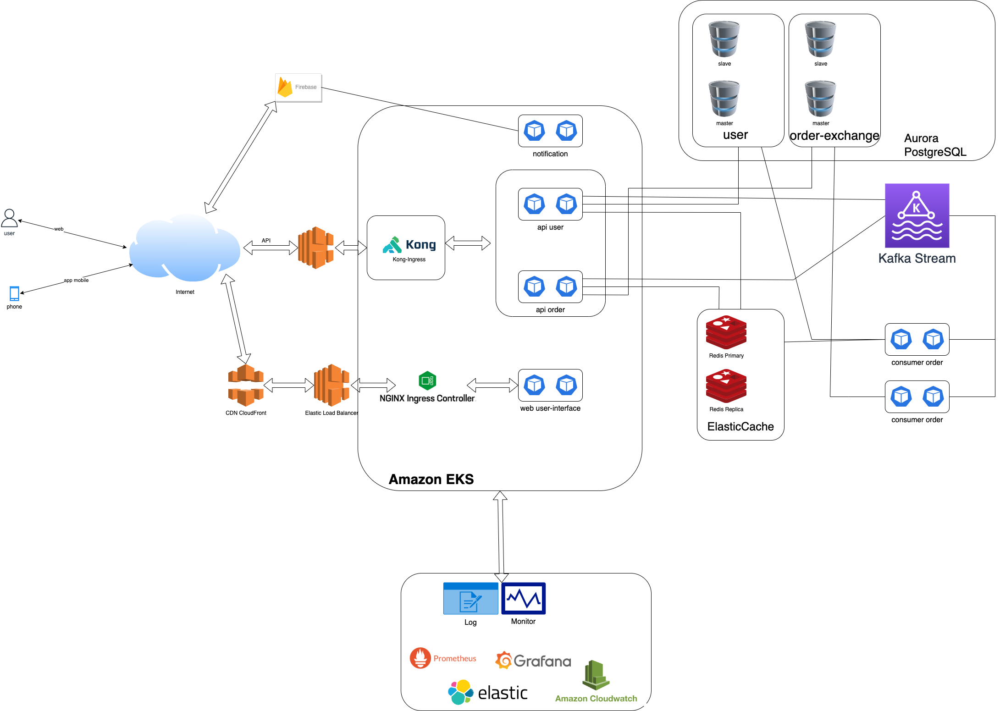

Task
Architecture a highly available trading system with similar features to the Binance trading platform https://www.binance.com. This system will need to be resilient to failures, scalable, and cost-effective. You should design the architecture, choose the appropriate technologies, and explain your approach for maintaining high availability and scalability.
Due to time constraint, you will not be able to cover every feature on the reference platform, so choose some features that will help you demonstrate your mastery of cloud infrastructure.
Deliverables
Your submission should include:
An overview diagram of the services used and what role they play in the system.
Elaboration on why each cloud service is used and what are the alternatives considered.
Plans for scaling when the product grows beyond your current setup.
Specifications
You are limited to the following constraints for your plan.
Cloud Provider
Amazon Web Services (AWS)
Throughput
500 requests per second
Response Time
p99 response time of <100ms

Solution:
Because there is no requirement for specific components and the task only calls for a system similar to Binance, the design provided is only high-level. If there were more detailed requirements and specific components, I could create a more comprehensive design.

Architectural Components
- User Interface (UI): Built using modern JS frameworks like React (for web) and React Native (for mobile apps) for a seamless user experience.
- ingress: Manage incoming requests to the system (using Kong Ingress for the API and NGINX Ingress for the web application).
- Elastic Load Balancing (ELB) to distribute incoming application or network traffic across multiple targets.
- CDN cloudfront: commonly used to speed up content delivery, minimize latency, and reduce the load on origin servers by serving requests from the location closest to the end users.
- Database:
    + Amazon RDS (PostgreSQL) for relational data such as user information and order exchange.
    + Redis for caching and session management to enhance performance.
- Data Streaming: Apache Kafka for ingesting real-time user activities,trade and market data
- Monitoring and Logging:
    + Utilize Prometheus and Grafana for real-time monitoring and alerts.
    + Centralize logging using Elastic Stack (ELK) or AWS CloudWatch Logs for log analysis and auditing.
- Infrastructure and Deployment:
    + Use Kubernetes (AWS EKS or Azure AKS) for container orchestration.
    + Implement CI/CD pipelines using gitlab-ci & argocd for fast and reliable deployments
      Plans for scaling when the product grows beyond your current setup:
- use HPA & KEDA for scaling pod/container deployment.
- use Karpenter  for scaling node in EKS cluster.
- use autoscaling amazon aurora.
